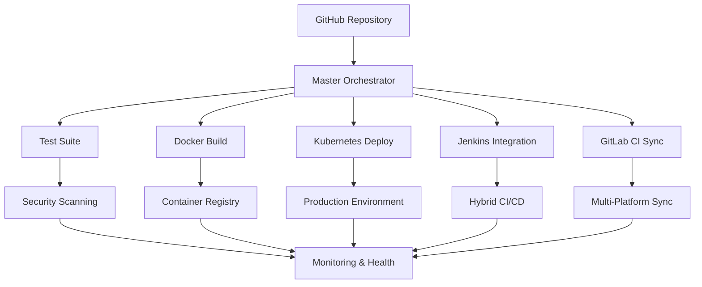

# 🚀 Enterprise-Grade CI/CD Workflows Documentation

## 📋 Overview

This repository includes a comprehensive, enterprise-grade CI/CD pipeline that supports multiple platforms, deployment strategies, and monitoring systems. The workflow architecture is designed for scalability, reliability, and security.

## 🏗️ Architecture Overview



## 🔄 Workflow Categories

### 1. 🎯 Master Orchestrator
**File**: `master-orchestrator.yml`

**Purpose**: Central control for all CI/CD operations with intelligent workflow orchestration.

**Features**:
- ✅ Intelligent deployment planning based on input parameters
- ✅ Multi-platform deployment coordination (GitHub + Jenkins + GitLab)
- ✅ Environment-specific deployment strategies
- ✅ Comprehensive monitoring and reporting
- ✅ Automatic rollback capabilities

**Triggers**:
- Push to `main` branch
- Tag creation (`v*`)
- Manual dispatch with customizable parameters

**Deployment Types**:
- `full`: Complete pipeline (tests + containers + k8s + jenkins)
- `containers-only`: Docker build and registry push only
- `kubernetes-only`: Kubernetes deployment only
- `jenkins-only`: Jenkins integration only
- `test-only`: Testing suite only

### 2. 🧪 Testing & Quality Assurance

#### Test Suite (`test-suite.yml`)
- **Unit Tests**: Component and utility testing with Vitest
- **Integration Tests**: API and content collection validation
- **E2E Tests**: Cross-browser testing with Playwright
- **Visual Regression**: Automated screenshot comparisons
- **Coverage Reports**: Comprehensive code coverage analysis

#### Security & Compliance (`security-compliance.yml`)
- **Dependency Scanning**: Automated vulnerability detection
- **CodeQL Analysis**: Advanced code security analysis
- **Secret Scanning**: Prevention of credential leaks
- **License Compliance**: Open source license validation
- **Docker Security**: Container vulnerability scanning

#### Quality Checks (`quality-check.yml`, `biome.yml`)
- **Code Linting**: Biome-based code quality checks
- **Type Checking**: TypeScript validation
- **Build Verification**: Ensuring successful builds
- **Performance Analysis**: Build time and bundle size monitoring

### 3. 🐳 Containerization & Registry

#### Docker Build (`docker-containers.yml`)
- **Multi-stage Builds**: Optimized container images
- **Multi-platform Support**: ARM64 and AMD64 architectures
- **Container Security**: Trivy vulnerability scanning
- **Performance Testing**: Container startup and resource usage
- **Registry Management**: GitHub Container Registry integration

**Features**:
- ✅ Multi-architecture builds (linux/amd64, linux/arm64)
- ✅ Container structure testing
- ✅ Security scanning with Trivy
- ✅ Performance benchmarking
- ✅ Automatic image tagging and versioning

### 4. ☸️ Kubernetes Orchestration

#### Kubernetes Deploy (`kubernetes-deploy.yml`)
- **Automated Deployments**: Environment-specific deployments
- **Health Monitoring**: Readiness and liveness probes
- **Auto-scaling**: Horizontal Pod Autoscaler configuration
- **Rollback Support**: Automatic rollback on failure
- **Monitoring Setup**: Prometheus ServiceMonitor configuration

**Deployment Features**:
- ✅ Multi-environment support (staging/production)
- ✅ Blue-green deployment strategy
- ✅ Automatic SSL certificate management
- ✅ Resource limits and requests optimization
- ✅ Namespace isolation

### 5. 🔧 Platform Integration

#### Jenkins Integration (`jenkins-integration.yml`)
- **Hybrid CI/CD**: GitHub Actions + Jenkins coordination
- **Job Triggering**: Remote Jenkins job execution
- **Status Monitoring**: Real-time pipeline monitoring
- **Artifact Sync**: Cross-platform artifact sharing
- **Multi-platform Deployment**: Coordinated deployment strategies

#### GitLab CI Integration (`gitlab-integration.yml`)
- **Repository Mirroring**: Automatic GitLab sync
- **Pipeline Triggering**: GitLab CI pipeline coordination
- **Cross-platform Status**: Unified status reporting
- **Artifact Management**: GitLab artifact downloading

### 6. 📊 Monitoring & Health

#### Monitoring & Health (`monitoring-health.yml`)
- **Uptime Monitoring**: 24/7 availability checks
- **Performance Auditing**: Lighthouse performance testing
- **SSL Monitoring**: Certificate expiration tracking
- **Broken Link Detection**: Automated link validation
- **Health Dashboard**: Comprehensive system status

#### Daily Health Check (`daily-health-check.yml`)
- **Automated Testing**: Daily system validation
- **Dependency Monitoring**: Outdated package detection
- **Security Auditing**: Regular vulnerability scans
- **Build Verification**: Daily build health checks

### 7. 🚀 Deployment Strategies

#### Preview Deployment (`preview-deployment.yml`)
- **PR Previews**: Automatic preview environments
- **Visual Regression**: UI change validation
- **Performance Testing**: Lighthouse audits on PRs
- **Accessibility Validation**: A11y compliance checking

#### Advanced Deployment (`advanced-deployment.yml`)
- **Pre-deployment Validation**: Comprehensive checks before deployment
- **Blue-green Deployment**: Zero-downtime deployments
- **Post-deployment Testing**: Automated validation after deployment
- **Automatic Rollback**: Failure recovery mechanisms

#### CI/CD Pipeline (`ci-cd-pipeline.yml`)
- **Complete Pipeline**: Full development lifecycle automation
- **Commit Analytics**: Development metrics tracking
- **Error Handling**: Automatic issue creation on failures
- **Success Management**: Artifact cleanup and notifications

## 🔐 Security Features

### Multi-layered Security
1. **Code Analysis**: CodeQL security scanning
2. **Dependency Scanning**: Automated vulnerability detection
3. **Container Security**: Trivy vulnerability scanning
4. **Secret Management**: GitHub Secrets integration
5. **Access Control**: Environment-based permissions

### Compliance Monitoring
- **License Compliance**: Open source license validation
- **Security Policies**: Automated policy enforcement
- **Audit Trails**: Comprehensive logging and monitoring
- **Vulnerability Management**: Automatic security updates

## 🌐 Multi-Platform Support

### Supported Platforms
1. **GitHub Actions**: Native GitHub CI/CD
2. **Jenkins**: Enterprise CI/CD integration
3. **GitLab CI**: Cross-platform pipeline support
4. **Docker**: Containerized deployments
5. **Kubernetes**: Container orchestration
6. **Vercel**: Static site deployment

### Deployment Targets
- **GitHub Pages**: Static site hosting
- **Vercel**: Edge-optimized deployment
- **Docker Registry**: Container image storage
- **Kubernetes Clusters**: Scalable deployments
- **Jenkins Servers**: Enterprise CI/CD

## 📈 Monitoring & Metrics

### Key Metrics Tracked
- **Build Success Rate**: Pipeline reliability metrics
- **Deployment Frequency**: Release velocity tracking
- **Performance Metrics**: Site speed and Core Web Vitals
- **Security Metrics**: Vulnerability detection and resolution
- **Uptime Monitoring**: Service availability tracking

### Alerting System
- **GitHub Issues**: Automatic issue creation for failures
- **Email Notifications**: Critical alert notifications
- **Slack Integration**: Team collaboration alerts
- **Dashboard Updates**: Real-time status updates

## 🛠️ Configuration

### Required Secrets
```bash
# Vercel Deployment
VERCEL_TOKEN=your_vercel_token
VERCEL_ORG_ID=your_vercel_org_id
VERCEL_PROJECT_ID=your_vercel_project_id

# Jenkins Integration
JENKINS_URL=https://jenkins.your-domain.com
JENKINS_USER=your_jenkins_user
JENKINS_API_TOKEN=your_jenkins_api_token

# GitLab Integration
GITLAB_TOKEN=your_gitlab_token
GITLAB_PROJECT_ID=your_gitlab_project_id
GITLAB_URL=https://gitlab.com

# Container Registry
GITHUB_TOKEN=automatically_provided
```

### Environment Variables
```yaml
NODE_VERSION: '18'
PNPM_VERSION: '8'
REGISTRY: ghcr.io
IMAGE_NAME: ${{ github.repository }}
PRODUCTION_URL: 'https://your-portfolio-domain.com'
```

## 🚀 Usage Examples

### Manual Deployment
```bash
# Trigger full deployment
gh workflow run master-orchestrator.yml \
  -f deployment_type=full \
  -f target_environment=production

# Container-only deployment
gh workflow run master-orchestrator.yml \
  -f deployment_type=containers-only \
  -f target_environment=staging
```

### Testing
```bash
# Run complete test suite
gh workflow run test-suite.yml

# Security scan only
gh workflow run security-compliance.yml
```

### Monitoring
```bash
# Manual health check
gh workflow run monitoring-health.yml

# Daily health check (runs automatically)
gh workflow run daily-health-check.yml
```

## 🔧 Customization

### Adding New Environments
1. Update workflow environment configurations
2. Add new secrets for the environment
3. Configure deployment targets
4. Update monitoring endpoints

### Custom Deployment Strategies
1. Modify `master-orchestrator.yml` deployment planning
2. Add new deployment types to input options
3. Create corresponding workflow logic
4. Update documentation

### Integration with New Platforms
1. Create new integration workflow
2. Add authentication secrets
3. Configure cross-platform synchronization
4. Update master orchestrator

## 🐛 Troubleshooting

### Common Issues

#### Workflow Failures
1. Check workflow logs in GitHub Actions
2. Verify required secrets are configured
3. Validate environment configurations
4. Review dependency versions

#### Deployment Issues
1. Check target environment status
2. Verify deployment permissions
3. Review container image availability
4. Validate Kubernetes cluster connectivity

#### Integration Problems
1. Test external service connectivity
2. Verify API tokens and permissions
3. Check service endpoints
4. Review integration configurations

### Debug Mode
Enable debug logging by setting workflow inputs:
```yaml
debug_mode: true
verbose_logging: true
```

## 📚 Additional Resources

- [GitHub Actions Documentation](https://docs.github.com/en/actions)
- [Docker Best Practices](https://docs.docker.com/develop/best-practices/)
- [Kubernetes Documentation](https://kubernetes.io/docs/)
- [Jenkins User Documentation](https://www.jenkins.io/doc/)
- [GitLab CI/CD Documentation](https://docs.gitlab.com/ee/ci/)

## 🤝 Contributing

1. Follow the established workflow patterns
2. Test changes in development environment
3. Update documentation for new features
4. Ensure security best practices
5. Add appropriate monitoring and alerting

---

**This enterprise-grade CI/CD system provides comprehensive automation, monitoring, and deployment capabilities for modern software development workflows.** 🚀