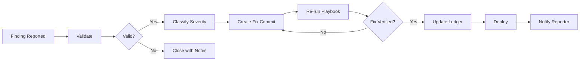

# Incident Response Procedures

> Version: 1.0.0
> Last updated: 2026-06-04
> Owner: PP Namias

## Vulnerability Disclosure Handling

### Reporting Channels

| Channel | Details |
|---------|---------|
| Email | pp.namias@gmail.com |
| security.txt | `/.well-known/security.txt` |

### Triage Flow

1. **Receive report** via email or security.txt
2. **Acknowledge** within 48 hours
3. **Validate** the finding (reproduce locally or in CI)
4. **Classify** severity using CVSS 3.1
5. **Remediate** per SLA below
6. **Re-verify** by running the relevant PentestAgent playbook
7. **Disclose** after fix is deployed

## Severity Classification

| Severity | CVSS Range | Response SLA | Examples |
|----------|------------|-------------|----------|
| Critical | 9.0-10.0 | 24 hours | RCE, auth bypass, data exfiltration |
| High | 7.0-8.9 | 72 hours | XSS, SSRF, SQL injection |
| Medium | 4.0-6.9 | 7 days | CSRF, missing headers, info disclosure |
| Low | 0.1-3.9 | 30 days | Verbose errors, missing security.txt |
| Informational | 0.0 | Next release | CSP improvements, cookie hardening |

## Remediation Workflow



## Post-Mortem Template

```markdown
## Incident: [ID]
- Date: YYYY-MM-DD
- Severity: [Critical/High/Medium/Low]
- Source: [PentestAgent scan / External disclosure / Internal audit]

### Timeline
- YYYY-MM-DD HH:MM - Finding detected
- YYYY-MM-DD HH:MM - Validated
- YYYY-MM-DD HH:MM - Fix committed ([commit hash])
- YYYY-MM-DD HH:MM - Re-verified
- YYYY-MM-DD HH:MM - Deployed

### Root Cause
[What allowed this vulnerability to exist?]

### Fix
[What was changed to fix it?]

### Prevention
[How to prevent similar issues in the future]
```

## Communication Plan

| Audience | Channel | Content |
|----------|---------|---------|
| Internal | GitHub Issue | Technical details, fix commit |
| Reporter | Email | Acknowledge, timeline, fix confirmation |
| Public | security.txt | After fix is deployed |

## Escalation

If a finding cannot be fixed within SLA:
1. Document compensating controls
2. Accept risk with owner approval
3. Set a review date
4. Monitor for changes in exploitability
