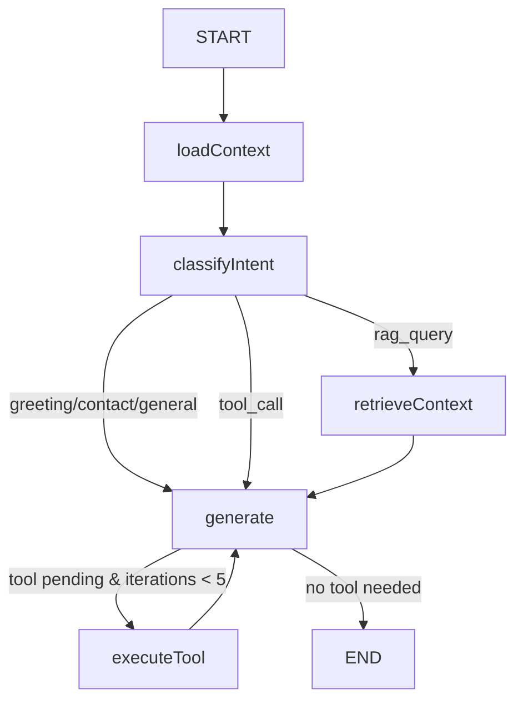

# AI Chatbot Architecture

## Overview

LangGraph.js state graph powering the portfolio's AI assistant. Wraps existing providers (Gemini, OpenAI, smart fallback) with a 6-node workflow, tool integration, thread persistence, and SSE streaming.

## State Graph (LangGraph)



### Nodes

| Node | Function | Purpose |
|------|----------|---------|
| `loadContext` | `loadContextNode` | Load CMS data (profile, projects, skills) via lazy singleton |
| `classifyIntent` | `classifyIntentNode` | Keyword-based intent routing (greeting, contact, tool_call, rag_query, general) |
| `retrieveContext` | `retrieveContextNode` | RAG vector search when intent is `rag_query` |
| `generate` | `generateNode` | Primary LLM call with Gemini → OpenAI → smartFallback chain |
| `executeTool` | `executeToolNode` | Manual tool dispatch based on user message keywords |

## Graph State

```typescript
GraphState {
  messages: BaseMessage[]          // LangChain message list
  threadId: string                 // Thread identifier
  chatDataContext: ChatDataContext  // CMS content singleton
  ragContext: string               // Retrieved RAG context
  ragChunks: unknown[]             // Raw RAG chunks
  intent: ChatIntent               // Classified intent
  toolIterations: number           // Tool loop counter (max 5)
  systemPrompt: string             // Built system prompt
  providerAttempts: Record[]       // Provider attempt log
  userMessage: string              // Current user message
  history: ConversationHistory[]   // Conversation history
  toolCallPending: string | null   // Active tool name
}
```

## API Routes

### `POST /api/chat`

- `Accept: text/event-stream` → SSE streaming response
- Without streaming header → JSON response
- Supports both LangGraph (gated by `IS_LANGGRAPH_ENABLED`) and legacy flow

### `GET /api/chat/threads`

List all threads. Returns `{ threads: ThreadMetadata[] }`.

### `POST /api/chat/threads`

Create thread. Body: `{ title: string }`. Returns `{ thread: ThreadMetadata }`.

### `GET /api/chat/threads/[id]`

Get thread + messages. Returns `{ thread: ThreadMetadata, messages: PersistedMessageRecord[] }`.

### `PATCH /api/chat/threads/[id]`

Rename thread. Body: `{ title: string }`. Returns `{ thread: ThreadMetadata }`.

### `DELETE /api/chat/threads/[id]`

Delete thread + its messages + checkpoint.

## SSE Event Stream

| Event | Data | Description |
|-------|------|-------------|
| `status` | `{ step, threadId }` | Lifecycle: classifying, generating, error, done |
| `token` | `{ content }` | Progressive word-level token |
| `tool_call` | `{ name, args }` | Tool execution indicator |
| `done` | `{ threadId }` | Stream complete |
| `error` | `{ error }` | Stream error |

## Tools

| Tool | Source | Trigger Keywords | Config |
|------|--------|-----------------|--------|
| `web_search` | DuckDuckGo | `search`, `find`, `lookup` | No API key needed |
| `calculator` | Inline math | `calculate`, `calculator`, `add/sub/mul/div` | First two numbers parsed |
| `stock_price` | Alpha Vantage | `stock`, `price` | `ALPHA_VANTAGE_API_KEY` env |
| `portfolio_query` | CMS data | `project`, `experience`, `skill`, `certification` | Uses chatDataContext |
| `send_message` | System | N/A (reserved) | Adds assistant message to state |

## Persistence

JSON-file storage at `.chat-data/`:

| File | Content |
|------|---------|
| `threads.json` | Thread metadata (title, timestamps, message count) |
| `messages.json` | Per-thread message log |
| `checkpoints.json` | LangGraph state checkpoints |

Max 50 threads — oldest auto-archived on create.

## Feature Flags (`src/lib/features.ts`)

| Flag | Default | Effect |
|------|---------|--------|
| `IS_LANGGRAPH_ENABLED` | `true` | Use LangGraph graph instead of legacy flow |
| `IS_CHAT_STREAMING_ENABLED` | `true` | Enable SSE streaming |
| `IS_CHAT_THREADING_ENABLED` | `true` | Enable thread sidebar + persistence |

## UI Components

```
FloatingHub (entry point)
├── HubMenu (recent threads + quick actions)
└── ChatPanel (messages + streaming + thread sidebar)
    ├── ThreadSidebar (thread CRUD)
    └── ThreadToggle (sidebar visibility)
```

## Hooks

| Hook | Purpose |
|------|---------|
| `useChatStream` | SSE event stream consumer with AbortController |

## Development

```bash
# Run tests
npm run test -- --run src/__tests__/chat/
npm run test -- --run src/__tests__/api/chat.test.ts
npm run test -- --run src/__tests__/hooks/use-chat-stream.test.tsx

# Type check
npx tsc --noEmit

# Lint
npm run lint
```
