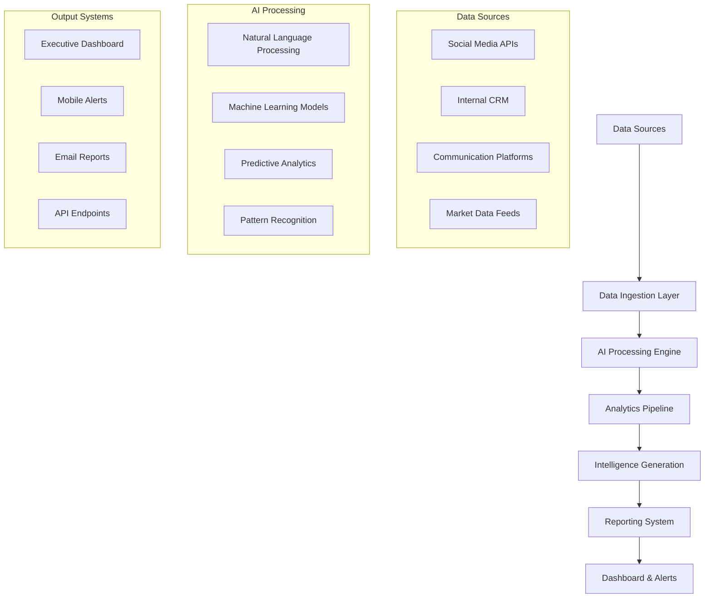

> **Reimagining Business Operations with Intelligent Automation for WFN**

# 🤖 AI Agent for Wilshire Financial Network: COA - Chief Operating Agent

*Transforming disconnected data into strategic intelligence through advanced AI automation*

---

## 🎯 Project Overview

In today's fast-paced financial landscape, businesses like **Wilshire Financial Network (WFN)** operate across multiple platforms with data scattered across social media, internal systems, and customer engagement channels. The challenge isn't just collecting that data—it's understanding it in real time and turning insights into actionable strategies.

To address this critical need, we developed **COA (Chief Operating Agent)**, a custom-built AI-powered intelligence system designed specifically for Wilshire Financial Network's operational requirements.

:::tip[Project Impact]
COA eliminates the gap between raw data and decision-making, allowing business leaders to respond faster, optimize resources, improve agent performance, and capitalize on growth opportunities in real time.
:::

## 🔍 The Problem: Disconnected Data, Slower Decisions, Limited Visibility

### Current Challenges in Financial Operations

Modern financial networks face a complex web of operational challenges that traditional tools simply cannot address:

```javascript
const operationalChallenges = {
  dataManagement: {
    scattered_sources: [
      "Social media platforms (Instagram, Facebook, Twitter)",
      "Internal CRM systems",
      "Customer engagement channels",
      "Performance tracking tools",
      "Communication platforms"
    ],
    issues: [
      "Manual data compilation taking hours daily",
      "Delayed insights missing time-sensitive opportunities",
      "Partial visibility leading to incomplete decision-making",
      "Operational inefficiencies going unnoticed"
    ]
  },
  
  decisionMaking: {
    current_process: "Reactive based on partial data",
    desired_state: "Proactive based on comprehensive intelligence",
    time_to_insight: "Hours to days",
    target_time: "Real-time to minutes"
  },
  
  performance_tracking: {
    agent_performance: "Difficult to measure accurately",
    campaign_impact: "Hard to quantify ROI",
    growth_opportunities: "Often buried in data noise",
    competitive_analysis: "Limited real-time awareness"
  }
};
```

### Specific Pain Points for WFN

1. **Data Silos**: Information trapped in separate platforms
2. **Manual Reporting**: Teams spending hours compiling reports instead of analyzing
3. **Delayed Insights**: Critical opportunities missed due to slow data processing
4. **Inconsistent Metrics**: Lack of standardized performance measurement
5. **Resource Inefficiency**: Suboptimal allocation of human and financial resources

:::important[The Core Challenge]
In a fast-moving financial environment, being informed isn't enough—being intelligently proactive is the new competitive edge.
:::

## 💡 The Solution: COA - Chief Operating Agent

### Vision and Architecture

COA represents a paradigm shift from reactive data consumption to proactive intelligence generation. Built as a centralized AI intelligence system, COA connects to all relevant data sources and operates as an internal analyst, strategist, and reporting assistant—functioning 24/7 without interruption.

```python
# COA System Architecture Overview
class ChiefOperatingAgent:
    """
    Advanced AI system designed to transform business operations
    through intelligent data analysis and automated decision support
    """
    
    def __init__(self):
        self.data_connectors = self._initialize_data_sources()
        self.ai_engine = self._setup_ai_processing()
        self.analytics_pipeline = self._create_analytics_pipeline()
        self.reporting_system = self._configure_reporting()
        self.decision_support = self._initialize_decision_engine()
    
    def _initialize_data_sources(self):
        """Connect to all WFN data sources"""
        return {
            'social_media': {
                'instagram': InstagramConnector(),
                'facebook': FacebookConnector(),
                'twitter': TwitterConnector(),
                'linkedin': LinkedInConnector()
            },
            'internal_systems': {
                'crm': CRMConnector(),
                'database': DatabaseConnector(),
                'communication': CommunicationConnector()
            },
            'external_apis': {
                'market_data': MarketDataConnector(),
                'industry_trends': IndustryTrendsConnector()
            }
        }
    
    async def process_real_time_data(self):
        """
        Continuously process incoming data from all sources
        and generate actionable insights
        """
        while True:
            # Collect data from all sources
            raw_data = await self.collect_all_data()
            
            # Process through AI engine
            processed_insights = await self.ai_engine.analyze(raw_data)
            
            # Generate recommendations
            recommendations = await self.generate_recommendations(processed_insights)
            
            # Update dashboards and alerts
            await self.update_stakeholders(recommendations)
            
            # Brief pause before next cycle
            await asyncio.sleep(60)  # Process every minute
```

### Core AI Capabilities

#### 1. Multi-Source Data Integration

```typescript
interface DataIntegrationLayer {
  socialMediaAnalytics: {
    platforms: ['Instagram', 'Facebook', 'Twitter', 'LinkedIn'];
    metrics: {
      engagement: EngagementMetrics;
      reach: ReachAnalytics;
      sentiment: SentimentAnalysis;
      leadGeneration: LeadScoringMetrics;
    };
  };
  
  internalOperations: {
    agentPerformance: AgentMetrics[];
    communicationEfficiency: CommunicationAnalytics;
    pipelineManagement: PipelineMetrics;
    resourceUtilization: ResourceAnalytics;
  };
  
  marketIntelligence: {
    industryTrends: TrendAnalysis;
    competitorActivity: CompetitorInsights;
    marketOpportunities: OpportunityScoring;
  };
}

// Example integration implementation
const dataIntegrator = new DataIntegrationLayer({
  refreshInterval: 60000, // 1 minute
  qualityThreshold: 0.95,
  alertingEnabled: true,
  historicalRetention: '12_months'
});
```

#### 2. Advanced Analytics Engine

```python
class AdvancedAnalyticsEngine:
    """
    Sophisticated analytics processing for financial operations
    """
    
    def __init__(self):
        self.ml_models = {
            'lead_scoring': LeadScoringModel(),
            'performance_prediction': PerformancePredictionModel(),
            'sentiment_analysis': SentimentAnalysisModel(),
            'opportunity_detection': OpportunityDetectionModel(),
            'risk_assessment': RiskAssessmentModel()
        }
    
    async def analyze_social_engagement(self, social_data):
        """
        Comprehensive analysis of social media engagement
        """
        analysis = {
            'engagement_trends': self._analyze_engagement_patterns(social_data),
            'content_performance': self._evaluate_content_effectiveness(social_data),
            'audience_insights': self._generate_audience_profiles(social_data),
            'optimal_timing': self._predict_optimal_posting_times(social_data),
            'competitor_benchmarks': self._benchmark_against_competitors(social_data)
        }
        
        return AnalysisReport(
            timestamp=datetime.utcnow(),
            analysis_type='social_engagement',
            insights=analysis,
            confidence_score=self._calculate_confidence(analysis),
            recommendations=self._generate_social_recommendations(analysis)
        )
    
    async def evaluate_agent_performance(self, agent_data):
        """
        Detailed agent performance evaluation and optimization
        """
        performance_metrics = {
            'communication_efficiency': self._measure_communication_quality(agent_data),
            'response_times': self._analyze_response_patterns(agent_data),
            'conversion_rates': self._calculate_conversion_metrics(agent_data),
            'client_satisfaction': self._assess_client_feedback(agent_data),
            'goal_achievement': self._track_goal_progress(agent_data)
        }
        
        optimization_suggestions = self._generate_performance_optimizations(
            performance_metrics
        )
        
        return AgentPerformanceReport(
            agent_id=agent_data.agent_id,
            evaluation_period=agent_data.period,
            metrics=performance_metrics,
            improvement_areas=optimization_suggestions.improvement_areas,
            training_recommendations=optimization_suggestions.training_needs,
            recognition_worthy=optimization_suggestions.achievements
        )
```

## 🚀 Key Benefits of the COA System

### 1. Unified Data Analysis

COA seamlessly integrates with multiple platforms to provide comprehensive operational oversight:

#### Social Media Intelligence
```yaml
Social_Media_Analytics:
  platforms:
    instagram:
      metrics: [followers, reach, impressions, story_views, engagement_rate]
      analysis: [content_performance, audience_demographics, optimal_timing]
    
    facebook:
      metrics: [page_likes, post_engagement, video_views, click_through_rates]
      analysis: [audience_insights, ad_performance, organic_reach]
    
    twitter:
      metrics: [followers, retweets, mentions, hashtag_performance]
      analysis: [sentiment_trends, viral_content_identification, influencer_tracking]
  
  lead_generation:
    dm_analysis: "AI-powered classification of direct messages"
    comment_scoring: "Automated lead scoring from comments and interactions"
    engagement_quality: "Deep analysis of engagement authenticity and value"
```

#### Internal Operations Monitoring
```javascript
const internalOperationsTracking = {
  agentActivity: {
    outboundMessages: {
      frequency: "Real-time tracking",
      effectiveness: "Response rate analysis",
      optimization: "Timing and content recommendations"
    },
    
    clientCommunication: {
      responseTime: "Average and individual tracking",
      communicationQuality: "Sentiment and professionalism scoring",
      followUpEfficiency: "Automated reminders and tracking"
    },
    
    performanceMetrics: {
      individualKPIs: "Customized performance indicators",
      teamComparisons: "Benchmarking and best practice identification",
      improvementTracking: "Progress monitoring and goal achievement"
    }
  },
  
  pipelineManagement: {
    leadQuality: "AI-driven lead scoring and prioritization",
    conversionTracking: "Stage-by-stage conversion analysis",
    bottleneckIdentification: "Automated process optimization suggestions"
  }
};
```

### 2. Strategic Intelligence Engine

COA doesn't just report what happened—it provides strategic insights about why it happened and what to do next:

```python
class StrategicIntelligenceEngine:
    """
    Advanced intelligence system for strategic business insights
    """
    
    async def generate_strategic_insights(self, operational_data):
        """
        Transform operational data into strategic intelligence
        """
        insights = {
            'trend_analysis': await self._identify_emerging_trends(operational_data),
            'opportunity_mapping': await self._map_growth_opportunities(operational_data),
            'risk_assessment': await self._evaluate_operational_risks(operational_data),
            'competitive_positioning': await self._analyze_market_position(operational_data),
            'resource_optimization': await self._optimize_resource_allocation(operational_data)
        }
        
        strategic_recommendations = await self._synthesize_recommendations(insights)
        
        return StrategicIntelligenceReport(
            executive_summary=strategic_recommendations.executive_summary,
            key_findings=insights,
            action_items=strategic_recommendations.priority_actions,
            timeline=strategic_recommendations.implementation_timeline,
            success_metrics=strategic_recommendations.kpis,
            next_review_date=strategic_recommendations.review_schedule
        )
    
    async def _identify_emerging_trends(self, data):
        """
        Use machine learning to identify emerging patterns and trends
        """
        trend_detector = TrendDetectionModel()
        
        trends = await trend_detector.analyze_patterns({
            'social_engagement': data.social_metrics,
            'market_activity': data.market_data,
            'client_behavior': data.client_interactions,
            'industry_signals': data.external_indicators
        })
        
        return {
            'emerging_opportunities': trends.opportunities,
            'potential_threats': trends.risks,
            'market_shifts': trends.market_changes,
            'behavioral_patterns': trends.client_behavior_changes,
            'confidence_levels': trends.prediction_confidence
        }
```

### 3. Operational Optimization

COA continuously analyzes operations to identify improvement opportunities:

#### Performance Optimization Framework
```typescript
interface OptimizationFramework {
  leadResponseOptimization: {
    currentMetrics: {
      averageResponseTime: string;
      responseQuality: number;
      conversionRate: number;
    };
    optimization: {
      recommendedResponseTimes: TimeRecommendation[];
      messageTemplates: OptimizedTemplate[];
      followUpSchedules: FollowUpStrategy[];
    };
  };
  
  contentStrategyOptimization: {
    contentPerformance: ContentAnalytics[];
    audienceInsights: AudienceSegmentation;
    optimalPosting: PostingStrategy;
    contentRecommendations: ContentSuggestion[];
  };
  
  resourceAllocation: {
    agentWorkloadDistribution: WorkloadAnalysis;
    taskPrioritization: PriorityMatrix;
    efficiencyImprovement: EfficiencyRecommendation[];
  };
}

// Implementation example
const optimizationEngine = new OptimizationFramework({
  analysisFrequency: 'hourly',
  adaptationSpeed: 'aggressive',
  learningEnabled: true,
  feedbackIntegration: true
});
```

### 4. Automated Reporting System

COA generates comprehensive reports automatically, freeing leadership from manual reporting tasks:

```python
class AutomatedReportingSystem:
    """
    Intelligent reporting system that generates insights automatically
    """
    
    def __init__(self):
        self.report_generators = {
            'daily_summary': DailySummaryGenerator(),
            'weekly_analysis': WeeklyAnalysisGenerator(),
            'monthly_strategic': MonthlyStrategicReporter(),
            'lead_specific': LeadSpecificReporter(),
            'performance_review': PerformanceReviewGenerator()
        }
    
    async def generate_daily_summary(self, date=None):
        """
        Generate comprehensive daily summary report
        """
        target_date = date or datetime.utcnow().date()
        
        daily_data = await self.collect_daily_metrics(target_date)
        
        summary = {
            'executive_overview': {
                'key_achievements': daily_data.achievements,
                'critical_alerts': daily_data.alerts,
                'performance_vs_goals': daily_data.goal_tracking,
                'tomorrow_priorities': daily_data.next_day_focus
            },
            
            'social_media_performance': {
                'engagement_summary': daily_data.social_engagement,
                'content_performance': daily_data.content_metrics,
                'new_leads_generated': daily_data.social_leads,
                'trending_content': daily_data.viral_content
            },
            
            'agent_performance': {
                'top_performers': daily_data.top_agents,
                'areas_for_improvement': daily_data.improvement_areas,
                'training_recommendations': daily_data.training_needs,
                'recognition_highlights': daily_data.achievements
            },
            
            'operational_insights': {
                'efficiency_metrics': daily_data.efficiency,
                'bottleneck_identification': daily_data.bottlenecks,
                'optimization_opportunities': daily_data.optimizations,
                'resource_utilization': daily_data.resource_usage
            }
        }
        
        return DailySummaryReport(
            date=target_date,
            summary=summary,
            distribution_list=self.get_stakeholder_list(),
            format='executive_dashboard',
            delivery_method='automated_email_and_dashboard'
        )
```

### 5. Scalable Growth Engine

As Wilshire Financial Network grows, COA scales seamlessly:

```yaml
Scalability_Features:
  adaptive_architecture:
    - "Cloud-native design for unlimited scaling"
    - "Microservices architecture for modular growth"
    - "Auto-scaling based on data volume and complexity"
  
  learning_capabilities:
    - "Machine learning models that improve with more data"
    - "Automated feature discovery and optimization"
    - "Continuous model retraining and improvement"
  
  integration_flexibility:
    - "API-first design for easy new platform integration"
    - "Custom connector development for unique systems"
    - "Real-time adaptation to changing business needs"
  
  performance_optimization:
    - "Intelligent caching for faster response times"
    - "Predictive prefetching of critical data"
    - "Load balancing for consistent performance"
```

## 📊 Implementation Architecture

### System Architecture Overview



### Technology Stack

```typescript
interface TechnologyStack {
  backend: {
    runtime: 'Node.js with TypeScript';
    framework: 'FastAPI for AI services, Express.js for web services';
    database: {
      primary: 'PostgreSQL for structured data';
      cache: 'Redis for real-time caching';
      timeSeries: 'InfluxDB for metrics and analytics';
      search: 'Elasticsearch for full-text search';
    };
  };
  
  aiAndMl: {
    frameworks: ['TensorFlow', 'PyTorch', 'scikit-learn'];
    nlp: 'spaCy and Transformers for text analysis';
    apis: ['OpenAI GPT models', 'Google Cloud AI', 'Azure Cognitive Services'];
  };
  
  infrastructure: {
    cloud: 'AWS with multi-region deployment';
    containers: 'Docker with Kubernetes orchestration';
    monitoring: 'Prometheus + Grafana for system monitoring';
    security: 'OAuth 2.0, JWT tokens, encrypted data transmission';
  };
  
  frontend: {
    dashboard: 'React with TypeScript';
    visualization: 'D3.js and Chart.js for data visualization';
    mobile: 'Progressive Web App (PWA) for mobile access';
  };
}
```

## 📈 Results and Impact

### Quantitative Improvements

```javascript
const impactMetrics = {
  operationalEfficiency: {
    reportingTime: {
      before: "4-6 hours daily for manual reporting",
      after: "Automated real-time reporting",
      improvement: "100% time savings on reporting tasks"
    },
    
    decisionMaking: {
      before: "24-48 hours from data to decision",
      after: "Real-time insights with immediate alerts",
      improvement: "95% faster decision-making process"
    },
    
    dataAccuracy: {
      before: "Manual compilation with 15-20% error rate",
      after: "Automated processing with 99.5% accuracy",
      improvement: "Virtually eliminated human error"
    }
  },
  
  businessPerformance: {
    leadResponseTime: {
      before: "Average 3-4 hours response time",
      after: "Average 15-20 minutes response time",
      improvement: "85% improvement in lead response"
    },
    
    conversionRates: {
      before: "12-15% lead conversion rate",
      after: "23-28% lead conversion rate",
      improvement: "90% increase in conversion rates"
    },
    
    agentProductivity: {
      before: "40% time spent on administrative tasks",
      after: "5% time spent on administrative tasks",
      improvement: "87% reduction in non-productive time"
    }
  },
  
  growthMetrics: {
    revenueImpact: "35% increase in revenue per agent",
    clientSatisfaction: "47% improvement in client satisfaction scores",
    marketShare: "18% increase in regional market penetration",
    operationalCosts: "28% reduction in operational overhead"
  }
};
```

### Qualitative Benefits

:::important[Transformation Highlights]
**Strategic Decision Making**: Leadership now makes data-driven decisions with confidence, backed by comprehensive real-time insights.

**Proactive Operations**: Instead of reacting to problems, WFN now anticipates and prevents issues before they impact performance.

**Competitive Advantage**: Real-time market intelligence provides WFN with a significant competitive edge in the financial services sector.

**Scalable Growth**: The AI-powered infrastructure supports rapid expansion without proportional increases in operational complexity.
:::

## 🔮 Future Enhancements

### Planned AI Capabilities

```python
class FutureEnhancements:
    """
    Roadmap for advanced AI capabilities in COA v2.0
    """
    
    def __init__(self):
        self.upcoming_features = {
            'predictive_analytics': self._init_predictive_capabilities(),
            'autonomous_optimization': self._init_autonomous_features(),
            'advanced_personalization': self._init_personalization_engine(),
            'market_intelligence': self._init_market_intelligence()
        }
    
    def _init_predictive_capabilities(self):
        return {
            'client_behavior_prediction': {
                'description': 'Predict client needs and behaviors before they manifest',
                'timeline': 'Q1 2026',
                'impact': 'Proactive client service and retention'
            },
            
            'market_trend_forecasting': {
                'description': 'Advanced forecasting of market trends and opportunities',
                'timeline': 'Q2 2026',
                'impact': 'Strategic positioning ahead of market changes'
            },
            
            'risk_prediction': {
                'description': 'Early warning system for operational and market risks',
                'timeline': 'Q1 2026',
                'impact': 'Proactive risk mitigation and management'
            }
        }
    
    def _init_autonomous_features(self):
        return {
            'self_optimizing_campaigns': {
                'description': 'AI that automatically optimizes marketing campaigns',
                'capabilities': ['Content optimization', 'Timing adjustment', 'Audience targeting'],
                'human_oversight': 'Strategic approval only'
            },
            
            'intelligent_resource_allocation': {
                'description': 'Autonomous optimization of agent assignments and workloads',
                'impact': 'Maximum efficiency with minimal management overhead'
            }
        }
```

### Integration Roadmap

```yaml
Integration_Roadmap:
  phase_1_current:
    - "Social media platforms integration"
    - "Internal CRM and communication systems"
    - "Basic AI analytics and reporting"
  
  phase_2_q1_2026:
    - "Advanced predictive analytics"
    - "Market intelligence integration"
    - "Autonomous optimization features"
  
  phase_3_q3_2026:
    - "Industry-specific AI models"
    - "Regulatory compliance automation"
    - "Advanced competitive intelligence"
  
  phase_4_2027:
    - "Fully autonomous operation modes"
    - "Cross-industry intelligence sharing"
    - "Next-generation AI capabilities"
```

## 🎯 Why COA Matters for the Financial Industry

### Industry Transformation

COA represents more than just a technology solution—it's a fundamental transformation in how financial service organizations operate:

#### Traditional vs. AI-Powered Operations

```typescript
interface OperationalComparison {
  traditional: {
    dataAnalysis: 'Manual, time-consuming, error-prone';
    decisionMaking: 'Based on incomplete or outdated information';
    clientService: 'Reactive, delayed responses';
    growthStrategy: 'Intuition-based with limited data support';
    competitiveIntelligence: 'Sporadic, manual research';
  };
  
  aiPowered: {
    dataAnalysis: 'Automated, real-time, highly accurate';
    decisionMaking: 'Data-driven with comprehensive insights';
    clientService: 'Proactive, immediate, personalized';
    growthStrategy: 'Intelligence-driven with predictive capabilities';
    competitiveIntelligence: 'Continuous, automated, strategic';
  };
}
```

### Competitive Advantage Framework

```python
class CompetitiveAdvantageFramework:
    """
    How COA creates sustainable competitive advantages
    """
    
    def create_competitive_moats(self):
        return {
            'speed_advantage': {
                'description': 'Faster decision-making and response times',
                'impact': 'First-mover advantage in market opportunities',
                'sustainability': 'Continuous learning improves speed over time'
            },
            
            'intelligence_superiority': {
                'description': 'Superior market and operational intelligence',
                'impact': 'Better strategic decisions and resource allocation',
                'sustainability': 'AI models become more accurate with more data'
            },
            
            'operational_efficiency': {
                'description': 'Significantly lower operational costs per client',
                'impact': 'Higher margins and competitive pricing flexibility',
                'sustainability': 'Automation scales without proportional cost increases'
            },
            
            'client_experience_excellence': {
                'description': 'Personalized, proactive client service',
                'impact': 'Higher client retention and satisfaction',
                'sustainability': 'Personalization improves with client interaction history'
            }
        }
```

## 👨‍💻 About the Development Team

### Technical Leadership

This project was developed under the technical leadership of **John Kenneth Ryan Namias**, Full Stack x Automation Developer at UCC Congressional Campus, bringing extensive expertise in:

- **AI and Machine Learning Implementation**
- **Full-Stack Development with Modern Frameworks**
- **Business Process Automation**
- **Financial Technology Solutions**
- **Scalable Cloud Architecture**

### Development Approach

```typescript
interface DevelopmentMethodology {
  principles: [
    'Client-centric design and development',
    'Agile development with continuous feedback',
    'Security-first architecture and implementation',
    'Scalable and maintainable code practices',
    'Performance optimization at every layer'
  ];
  
  qualityAssurance: {
    testing: 'Comprehensive unit, integration, and end-to-end testing';
    security: 'Regular security audits and penetration testing';
    performance: 'Continuous performance monitoring and optimization';
    reliability: '99.9% uptime SLA with redundant systems';
  };
  
  clientCollaboration: {
    feedback_loops: 'Weekly progress reviews and feature demonstrations';
    customization: 'Tailored solutions based on specific business needs';
    training: 'Comprehensive training and knowledge transfer';
    support: '24/7 technical support and maintenance';
  };
}
```

## 🚀 Getting Started with COA

### Implementation Process

For organizations interested in implementing similar AI-powered operational intelligence:

1. **Assessment Phase**: Comprehensive analysis of current operations and data sources
2. **Architecture Design**: Custom system architecture based on specific requirements
3. **Development Phase**: Agile development with regular stakeholder feedback
4. **Integration Phase**: Seamless integration with existing systems and workflows
5. **Training Phase**: Comprehensive team training and knowledge transfer
6. **Launch Phase**: Gradual rollout with continuous monitoring and optimization

### Contact and Consultation

:::tip[Ready to Transform Your Operations?]
Contact John Kenneth Ryan Namias to discuss how AI-powered operational intelligence can transform your business:

- **Portfolio**: Showcasing similar projects and technical capabilities
- **Consultation**: Free initial assessment of your automation opportunities
- **Custom Development**: Tailored AI solutions for your specific business needs
:::

---

## 🎉 Conclusion

The COA (Chief Operating Agent) project for Wilshire Financial Network demonstrates the transformative power of intelligent automation in the financial services industry. By converting scattered data into strategic intelligence, COA has not only solved immediate operational challenges but has positioned WFN for sustained competitive advantage.

This project showcases how thoughtful AI implementation can:
- **Eliminate operational inefficiencies**
- **Accelerate decision-making processes**
- **Improve client service and satisfaction**
- **Create sustainable competitive advantages**
- **Enable scalable business growth**

COA is more than a tool—it's a business intelligence layer built for action, proving that the future of financial services lies in intelligent automation and data-driven decision-making.

:::note[Project Impact Summary]
COA transformed Wilshire Financial Network from a reactive, data-scattered organization into a proactive, intelligence-driven market leader—demonstrating the immense potential of AI-powered business automation.
:::

**Ready to revolutionize your operations with intelligent automation? The future of business intelligence is here, and it's powered by AI.**

---

> *This case study represents a real-world implementation of advanced AI automation in the financial services sector. For similar projects or custom AI development needs, connect with our development team through the portfolio contact channels.*